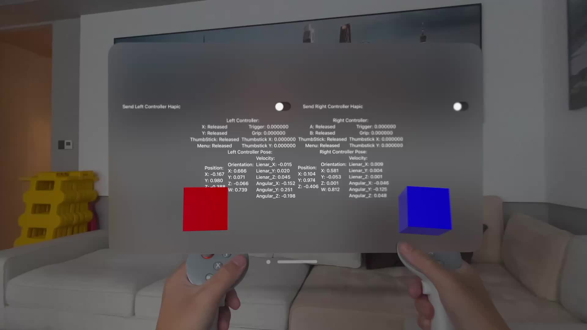

# Surreal Touch: Controller for Apple Vision Pro
Surreal Touch, developed by [Surreal Interactive](https://www.surreal-interactive.com/), is a VR gaming controller specifically designed for the Apple Vision Pro. This product aims to bridge the gap between the most immersive hardware and the vibrant VR game ecosystem.


## Get Started

### Requirements:
   - Xcode 16 or newer
   - VisionOS 2.0 or newer

### Install:
1. Download the SDK and extract it into a fold.

2. Open Xcode and navigate to the Package Manager by selecting File -> Add Package Dependency -> Add Local. Find the extracted path of the SDK.

3. Import package in your swift source file
   ```
   import SurrealInteractiveSDK
   import surreal_interactive_openxr_framework
   ```

4. SetUp Xcode Project Info.plist Configuration

   To enable Bluetooth and Hand Gesture functionalities in your Xcode project, you need to add the following keys to your `Info.plist` file:

    - **NSBluetoothAlwaysUsageDescription**: This key is required to request permission to use Bluetooth services. Provide a description of why your app needs access to Bluetooth.

      ```xml
      <key>NSBluetoothAlwaysUsageDescription</key>
      <string>This app requires Bluetooth access to connect to the Surreal Touch Controller.</string>
      ```

    - **NSBluetoothPeripheralUsageDescription**: This key is necessary for accessing Bluetooth peripherals. Again, provide a description of the need for this access.

      ```xml
      <key>NSBluetoothPeripheralUsageDescription</key>
      <string>This app needs to communicate with Bluetooth devices.</string>
      ```
    - **NSHandsTrackingUsageDescription**: This key is required to request permission to use hand tracking features. Provide a description of why your app needs access to hand tracking.

      ```xml
      <key>NSHandsTrackingUsageDescription</key>
      <string>This app requires hand tracking access to enable gesture-based controls with the Surreal Touch Controller.</string>
      ```
   Make sure to include these entries in your `Info.plist` file to ensure proper functionality of the SDK with Bluetooth and Hand Gestures.

This SDK provides a high-level API, similar to [OpenXR](https://registry.khronos.org/OpenXR/specs/1.0/html/xrspec.html#input), enabling you to receive input and send output to the controller.


## Example Project
For a practical demonstration of how to use the Surreal Interactive Swift SDK, please check out the example in the `example` folder.



You can try it via [TestFlight](https://testflight.apple.com/join/Y5HjZGGk)
